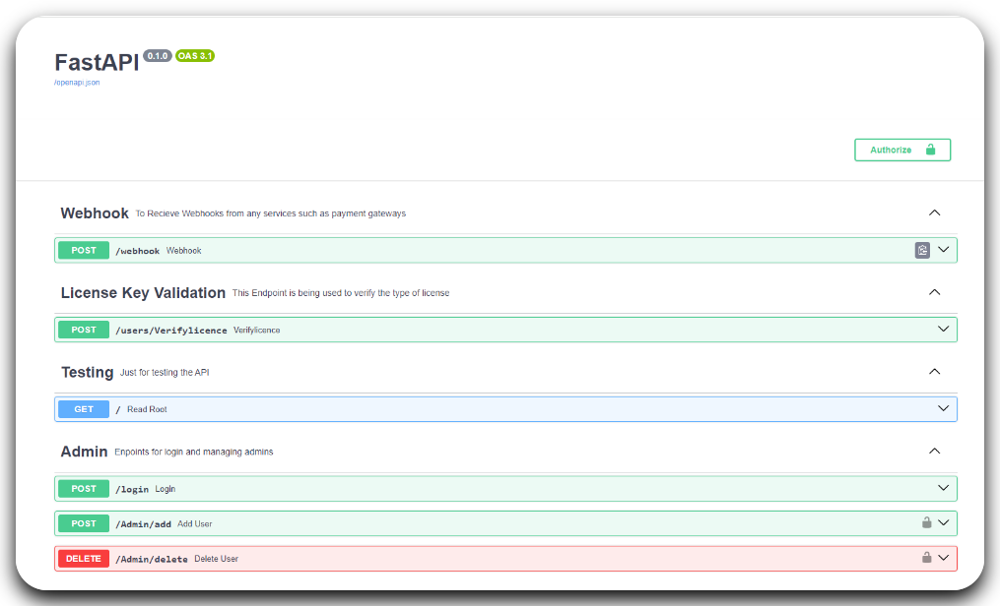

# FastAPI-SaaS Template


## Tech Stack and Features

- [FastAPI](https://fastapi.tiangolo.com/) - Python framework for building APIs.
    - 🙋 Whenever a new user is created the license details are generated and saved to database.
    - ➿ Fields to save product type, Licence validity, etc.
    - 💸 Generate users from webhooks using payment gateways.
- [Pydantic](https://docs.pydantic.dev) - Used by FastAPI, for data validation and settings management
- [PostgreSQL](https://www.postgresql.org) as the SQL database.
    - 💾 Two tables, one for user data and one for admin data.
    - 📃 Supports pagination and filters to easily create admin dashboards.
- [SQLAlchemy](https://www.sqlalchemy.org/) - SQL toolkit and Object-Relational Mapping (ORM) library.
    - 📄 Complete helper functions for CRUD operations on user and admin tables.
    - 🔐 All the passwords are secured using bcrypt hashing.
- [Alembic](https://alembic.sqlalchemy.org/) - Database migrations tool for SQLAlchemy.
    - ⚡Script to initialize the database from models and make changes as needed.
- [OAuth2](https://oauth.net/2/) - Authentication framework used for user authentication.
    - 🔒 Oauth2 Scopes for permissions for specific endpoints.
- [JWT](https://jwt.io/) - JSON Web Tokens for secure communication.
    - 🔑 Configurable JWT tokens from .env files
- [Pytest](https://pytest.org) - Unit and Integration testing using Pytest.
    - ✅ Tests are broadly divided into database tests and endpoint tests with reusable fixtures

## Table of Contents
- [Introduction](#introduction)
- [Installation](#installation)
- [Usage](#usage)
  - [Testing](#testing)
  - [Database Migrations](#database-migrations)
- [Project Structure](#project-structure)
- [Implementation Details](#implementation-details)
  - [Configurations](#configurations)
  - [Schema](#schema)
  - [License Key Generation](#license-key-generation)
- [To-Do](#to-do)
- [License](#license)


## Introduction

I developed a SaaS backend to create and manage the end users. It involved generating and verifying license keys for new software purchases, API endpoints for creating/deleting and modifying existing users, etc. All the endpoints are authenticated using JWT and OAuth2 with scopes to limit the access of endpoints.

I thought of making the entire template into a boilerplate code so that other people could save time when developing something similar.

## Installation

1. Clone the repository:

    ```bash
    git clone https://github.com/shekhuverma/FastAPI-SaaS-Template.git
    cd FastAPI-SaaS-Template
    ```
2. Create a virtual environment and activate it
   ```bash
   python -m venv venv
   ```
   Activate it using
   ```bash
   #on windows
   venv\Scripts\Activate
   #on linux
   source venv/Scripts/Activate
   ```
3. Install dependencies:

    ```bash
    pip install -r requirements.txt
    ```

## Usage

1. Configure the environment variables in the template.env file and rename it to
   .env
2. Run alembic migrations to create the tables.
   ```bash
   alembic upgrade head
   ```
   This will initialize the database and create the tables as per models.py
3. Add initial data to the database
   ```bash
   python -m src._init_db
   ```
   This will add the first admin to the admin database.
4. Run the application:

    ```bash
    cd src
    uvicorn main:app --reload
    ```
    or

    ```bash
    cd src
    fastapi dev
    ```

5. Visit `http://localhost:8000/docs` in your browser to access the API docs.



### Testing
All the tests are done using Pytest.

To run all the tests, run the following command

```bash
pytest tests
```

or you can use tox for testing and linting
```
tox
```
This will run all the tests, formats and lints the code using Ruff.

Tests are divided into 3 major types
1) Database tests - Contains the tests for database services and operations
2) User tests - Contains tests for all the user endpoints
3) Admin tests - Contains tests for authentication and admin endpoints.

### Database Migrations
If you change anything in the models.py file, then delete all the files from the alembic/versions directory and run the following command to generate the new migration.
```bash
alembic revisions --autogenerate -m "your message"
```
This will create a new migration with your changes in the models.

## Project Structure

```text
|   .pylintrc                       # Pylint configuration
|   alembic.ini                     # Alembic Config
|   LICENSE                         # License File
|   README.md                       # Project Readme
|   requirements.txt                # Dependencies
|
+---alembic                         # Alembic config folder
|   ├── env.py
|   ├── README
|   ├── script.py.mako
|   └── versions
|       └── 2024_05_17_initialising_database.py  # Migration to initialise the DB
+---src                             # Source code folder
|   ├── init_db.py                  # To initialise the database using superuser (First admin)
|   ├── main.py                     # Main.py, the app starts from here
|   ├── settings.py                 # Config and settings for the project
|   ├── db                          # Database related files
|   │   ├── database.py
|   │   ├── model.py
|   │   └── services.py
|   ├── docs                        # FastAPI Documentation metadata
|   │   ├── docs.py
|   ├── router                      # API routes files
|   │   ├── admin.py
|   │   ├── user.py
|   ├── schemas                     # Pydantic models for request/response schemas
|   │   ├── admins.py
|   │   ├── token.py
|   │   ├── users.py
|   ├── security                    # Security related files
|   │   ├── jwt.py                  # JWT generation code
|   │   ├── license.py              # Code/settings for generating license keys for users
|   │   ├── security.py             # Authentication and OAuth2
|   │   └── utils.py                # Misc helper functions
|   └── utils                       # Utility functions
|   |    └── csv_utils.py           # Utilities for uploading data using CSV files
|   |
+---tests                           # Test files
|   ├── admin_test.py               # Admin Tests, Login Tests
|   ├── conftest.py                 # Test Fixtures
|   ├── database_test.py            # Database services unit tests
|   └── user_test.py                # API tests
```

## Implementation Details

### Configurations
All the general configurations are in the setting.py file and .env file. Most of which are self-explanatory.
Used Pydantic-settings for dividing the configuration settings.

### Schema
Currently have 2 shemas, one for the database and the other for the users.
src/db/models.py
```text
users ->
    txid                # Saves the transaction ID
    amount              # Pucharse Amount
    payment_method      # Payment Method used for the purchase
    product             # Name of the product/ Product Type (ENUM src/schemas/users)
    email_id            # Email of the user
    contact_no          # Contact number of the user
    subscription        # Licence validity (in months)
    order_date          # Purchase Date
    Start_Date          # License Activation Date
    End_Date            # License Expiry Date
    License_Key         # Unique License Key
    License_Activated   # Whether the License key has been used or not
```

```text
admins ->
    username            # Admin Username (Must be unique,PK)
    disabled            # to disable the admin
    scope               # Scope of permissions (ENUM src/schemas/admins)
    hashed_password     # Password stored as hash
```

### License Key Generation
License keys are generated using Transaction_ID + Email_ID -> encrypting using AES. The implementation is in src/security/license.py. It is added as a dependency in create user endpoints.
You need to change the encryption keys SECRET_KEY and INITIALISATION_VECTOR from settings.py file.

## To-Do
- [x] Add Tox Support for automatic testing and linting.
- [ ] Add test cases for different OAuth Scopes.
- [ ] Add Docker Support.
- [ ] Add Deployment Scripts.
- [ ] Email or OTP-Based Password Recovery.
- [ ] Use poetry for dependency management. (maybe)

## License

This project is licensed under the [MIT License](LICENSE).
